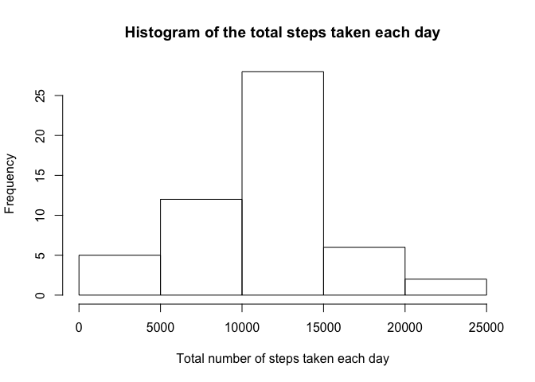
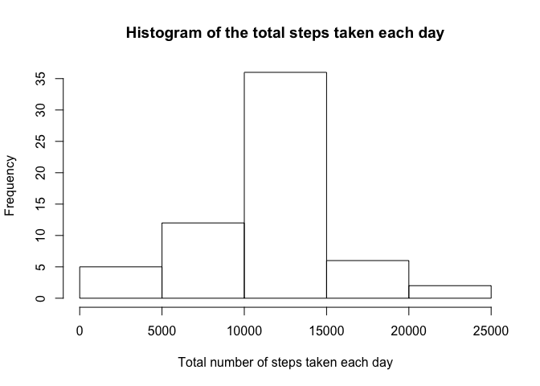

------------------------------------------------------------------------

output: md\_document: variant: markdown\_github --- \#My 1st Knit Project

Loading and preprocessing the data
----------------------------------

This is the code for preprocessing the data

``` r
setwd("/Users/AmirKh/Documents/R/Reproducible.Research/project1")
activity <- unzip("repdata-data-activity.zip")
act<-read.csv(activity)
rm(activity)
act<- as.data.frame(act)
```

What is mean total number of steps taken per day?
-------------------------------------------------

First, We calculate the total number of steps taken per day :

``` r
act.sum <- aggregate(x =act[c("steps")],
                     FUN = sum,
                     by = list(Group.date = act$date))
act.sum<-act.sum[is.na(act.sum$steps)==FALSE,]
```

histogram of the total number of steps taken each day : 

the mean of the total number of steps taken per day is 10766.1886792. the median of the total number of steps taken per day is 10765.

What is the average daily activity pattern?
-------------------------------------------

this is plot of the 5-minute interval (x-axis) and the average number of steps taken, averaged across all days (y-axis)


the 5-minute interval, on average across all the days in the dataset, that contains the maximum number of steps is 835

Imputing missing values
-----------------------

the total number of missing values in the dataset is 2304

Imputing mean steps by interval code :

``` r
act_full<-merge(act,act_avg,all.x=TRUE,by="interval")

for (i in 1:dim(act_full)[1]) {
        if ( is.na(act_full$steps.x[i]) )  {
                
                act_full$steps.x[i]<-act_full$steps.y[i]
        }
}
names(act_full)[2]<-"steps"
act_full<-act_full[,-4]             


act_full.sum <- aggregate(x =act_full[c("steps")],
                     FUN = sum,
                     by = list(Group.date = act_full$date))
act_full.sum<-act_full.sum[is.na(act_full.sum$steps)==FALSE,]
```

here is a histogram of the total number of steps taken each day



after the imputing : the mean of total number of steps taken per day is 10766.1886792 the median of total number of steps taken per day is 10766.1886792

Are there differences in activity patterns between weekdays and weekends?
-------------------------------------------------------------------------

the plot below shows the differences in activity patterns between weekdays and weekends 
